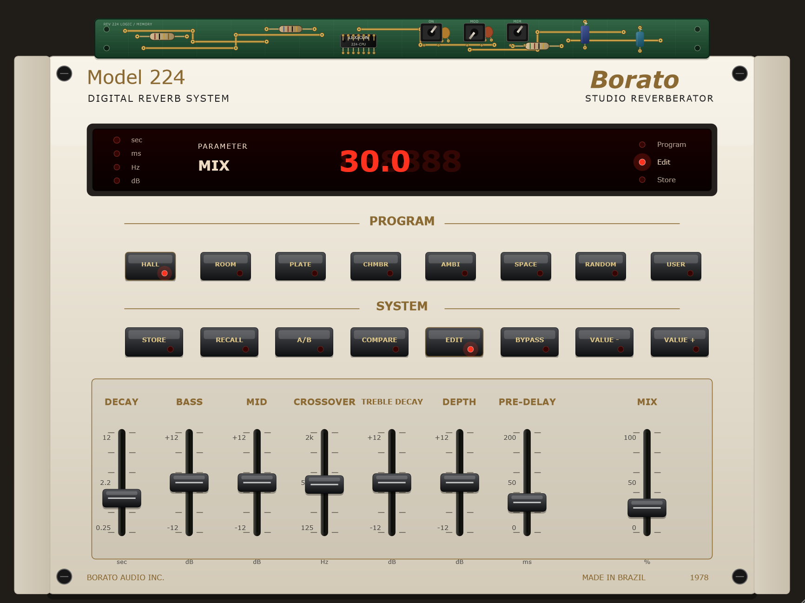

# Borato 224



Borato 224 is a vintage digital reverb plugin inspired by the workflow and hardware look of classic units such as the Lexicon 224. The project is built with JUCE, uses CMake as the main build path, and also keeps a functional `.jucer` file for Projucer-based workflows.

## Building the Project

### Requirements

- CMake 3.22 or newer.
- A local JUCE checkout. The default expected path on Windows is `C:\JUCE`.
- A C++20 compiler.
- VST3 support through JUCE.

Recommended toolchains:

- Windows: Visual Studio 2026/2022 with the C++ desktop workload, or another CMake-compatible C++20 toolchain.
- macOS: Xcode command line tools or full Xcode.
- Linux: GCC or Clang, plus the system packages required by JUCE.

### Choosing a CMake Generator

This project is generator-agnostic: use any CMake generator supported by your local compiler, JUCE checkout, and plugin SDK setup.

List the generators available on your machine:

```bash
cmake --help
```

Common choices:

```text
Visual Studio 18 2026    Windows + MSVC 2026
Visual Studio 17 2022    Windows + MSVC 2022
Ninja                    Windows/macOS/Linux with Ninja installed
Unix Makefiles           macOS/Linux, or Windows environments that provide make
Xcode                    macOS + Xcode
```

If CMake reports `could not find any instance of Visual Studio`, that Visual Studio version is not installed or not visible to CMake. Pick another generator from `cmake --help`, install the missing toolchain, or use a fresh build directory.

### Windows

Configure with the installed Visual Studio generator. Example for Visual Studio 2026:

```powershell
cmake -S . -B build -G "Visual Studio 18 2026" -A x64 -DBORATO224_JUCE_SOURCE_DIR=C:\JUCE
```

If you have Visual Studio 2022 installed instead, use:

```powershell
cmake -S . -B build-vs2022 -G "Visual Studio 17 2022" -A x64 -DBORATO224_JUCE_SOURCE_DIR=C:\JUCE
```

Example with Ninja, if Ninja and a C++20 compiler are installed and available in the current shell:

```powershell
cmake -S . -B build-ninja -G Ninja -DCMAKE_BUILD_TYPE=Debug -DBORATO224_JUCE_SOURCE_DIR=C:\JUCE
cmake --build build-ninja
```

Release with Ninja:

```powershell
cmake -S . -B build-ninja-release -G Ninja -DCMAKE_BUILD_TYPE=Release -DBORATO224_JUCE_SOURCE_DIR=C:\JUCE
cmake --build build-ninja-release
```

Build Debug:

```powershell
cmake --build build --config Debug
```

Build Release:

```powershell
cmake --build build --config Release
```

The VST3 output is generated under:

```text
build/Borato224_artefacts/Debug/VST3/Borato 224.vst3
build/Borato224_artefacts/Release/VST3/Borato 224.vst3
```

By default the CMake build does not install the plugin into `C:\Program Files\Common Files\VST3`, because that usually requires administrator permissions. To enable post-build copying to the system VST3 folder, configure with:

```powershell
cmake -S . -B build -G "Visual Studio 18 2026" -A x64 -DBORATO224_JUCE_SOURCE_DIR=C:\JUCE -DBORATO224_COPY_PLUGIN_AFTER_BUILD=ON
```

If CMake reconfiguration fails because it points to a missing MSVC toolset, the build directory has stale compiler cache. Reconfigure the existing build directory with the installed generator:

```powershell
cmake -S . -B build -G "Visual Studio 18 2026" -A x64 -DBORATO224_JUCE_SOURCE_DIR=C:\JUCE
cmake --build build --config Debug
```

Or create a fresh build directory:

```powershell
cmake -S . -B build-vs2026 -G "Visual Studio 18 2026" -A x64 -DBORATO224_JUCE_SOURCE_DIR=C:\JUCE
cmake --build build-vs2026 --config Debug
```

### macOS

Install Xcode command line tools:

```bash
xcode-select --install
```

Configure with a local JUCE checkout:

```bash
cmake -S . -B build -DBORATO224_JUCE_SOURCE_DIR=/path/to/JUCE
```

Optional Xcode generator:

```bash
cmake -S . -B build-xcode -G Xcode -DBORATO224_JUCE_SOURCE_DIR=/path/to/JUCE
cmake --build build-xcode --config Debug
```

Release with Xcode:

```bash
cmake --build build-xcode --config Release
```

Optional Ninja generator:

```bash
cmake -S . -B build-ninja -G Ninja -DCMAKE_BUILD_TYPE=Debug -DBORATO224_JUCE_SOURCE_DIR=/path/to/JUCE
cmake --build build-ninja
```

Release with Ninja:

```bash
cmake -S . -B build-ninja-release -G Ninja -DCMAKE_BUILD_TYPE=Release -DBORATO224_JUCE_SOURCE_DIR=/path/to/JUCE
cmake --build build-ninja-release
```

Build Debug:

```bash
cmake --build build --config Debug
```

Build Release:

```bash
cmake --build build --config Release
```

The build can produce `VST3`, `AU`, and `Standalone` targets on macOS, depending on the local JUCE and SDK setup.

### Linux

Install common JUCE build dependencies. Package names vary by distribution; on Debian/Ubuntu this is a typical starting point:

```bash
sudo apt update
sudo apt install build-essential cmake pkg-config libasound2-dev libjack-jackd2-dev \
  libfreetype6-dev libfontconfig1-dev libx11-dev libxcomposite-dev libxcursor-dev \
  libxext-dev libxinerama-dev libxrandr-dev libxrender-dev libwebkit2gtk-4.1-dev
```

Configure:

```bash
cmake -S . -B build -DCMAKE_BUILD_TYPE=Debug -DBORATO224_JUCE_SOURCE_DIR=/path/to/JUCE
```

Equivalent explicit generator examples:

```bash
cmake -S . -B build-ninja -G Ninja -DCMAKE_BUILD_TYPE=Debug -DBORATO224_JUCE_SOURCE_DIR=/path/to/JUCE
cmake -S . -B build-make -G "Unix Makefiles" -DCMAKE_BUILD_TYPE=Debug -DBORATO224_JUCE_SOURCE_DIR=/path/to/JUCE
```

Release with explicit generators:

```bash
cmake -S . -B build-ninja-release -G Ninja -DCMAKE_BUILD_TYPE=Release -DBORATO224_JUCE_SOURCE_DIR=/path/to/JUCE
cmake --build build-ninja-release

cmake -S . -B build-make-release -G "Unix Makefiles" -DCMAKE_BUILD_TYPE=Release -DBORATO224_JUCE_SOURCE_DIR=/path/to/JUCE
cmake --build build-make-release
```

Build:

```bash
cmake --build build
```

For Release:

```bash
cmake -S . -B build-release -DCMAKE_BUILD_TYPE=Release -DBORATO224_JUCE_SOURCE_DIR=/path/to/JUCE
cmake --build build-release
```

Linux builds normally produce `VST3` and `Standalone`. AU is a macOS-only format.

### GitHub Actions Release Artifacts

The repository includes a release artifact workflow:

```text
.github/workflows/build-macos-release.yml
```

It builds Release artifacts on `macos-latest` and `ubuntu-latest`, downloading JUCE through CMake with `BORATO224_FETCH_JUCE=ON`.

macOS artifacts:

```text
Borato224-v0.0.3-macOS-VST3.zip
Borato224-v0.0.3-macOS-AU.zip
Borato224-v0.0.3-macOS-Standalone.zip
Borato224-v0.0.3-macOS-install-notes
```

Ubuntu artifacts:

```text
Borato224-v0.0.3-Ubuntu-VST3.tar.gz
Borato224-v0.0.3-Ubuntu-Standalone.tar.gz
Borato224-v0.0.3-Ubuntu-install-notes
```

The workflow runs on pushes to `master`, `release/**`, `ci/**`, version tags such as `v0.0.3`, pull requests to `master`, and manual `workflow_dispatch`.

To download the files:

1. Open the repository on GitHub.
2. Go to `Actions`.
3. Open the latest `Build Release Artifacts` run.
4. Download `Borato224-v0.0.3-macOS-release-assets` and/or `Borato224-v0.0.3-Ubuntu-release-assets` from the run summary.
5. Extract the downloaded artifact bundle and attach the contained archives to the GitHub release.

To create release assets automatically, push a version tag:

```bash
git tag v0.0.3
git push origin v0.0.3
```

The workflow will build Release artifacts and create/update a draft GitHub Release for that tag with:

```text
Borato224-v0.0.3-macOS-VST3.zip
Borato224-v0.0.3-macOS-AU.zip
Borato224-v0.0.3-macOS-Standalone.zip
INSTALL-macOS.md
Borato224-v0.0.3-Ubuntu-VST3.tar.gz
Borato224-v0.0.3-Ubuntu-Standalone.tar.gz
INSTALL-Ubuntu.md
```

#### Install on macOS

Unzip the artifacts and install:

```text
Borato 224.vst3       -> ~/Library/Audio/Plug-Ins/VST3/
Borato 224.component  -> ~/Library/Audio/Plug-Ins/Components/
Borato 224.app        -> /Applications or any local folder
```

The current CI builds are unsigned and not notarized. If macOS blocks them after download, remove quarantine after unzipping:

```bash
xattr -dr com.apple.quarantine "Borato 224.vst3"
xattr -dr com.apple.quarantine "Borato 224.component"
xattr -dr com.apple.quarantine "Borato 224.app"
```

#### Install on Ubuntu

Extract the VST3 archive and install it to your user VST3 folder:

```bash
mkdir -p ~/.vst3
tar -xzf Borato224-v0.0.3-Ubuntu-VST3.tar.gz
cp -R "Borato 224.vst3" ~/.vst3/
```

Then open your DAW and rescan plugins. Common Linux VST3 scan paths include:

```text
~/.vst3/
/usr/local/lib/vst3/
/usr/lib/vst3/
```

The per-user path `~/.vst3/` is recommended for testing because it does not require administrator permissions.

To run the standalone Ubuntu build:

```bash
tar -xzf Borato224-v0.0.3-Ubuntu-Standalone.tar.gz
chmod +x "Borato 224"
./"Borato 224"
```

If the standalone app does not start, install the same JUCE runtime dependencies listed in the Linux build section above.

### Projucer Workflow

You can also open:

```text
Borato224.jucer
```

Confirm that the JUCE module paths point to your local JUCE checkout, save the project, then build through the generated IDE project under:

```text
Builds/VisualStudio2022/
Builds/VisualStudio2026/
```

On macOS or Linux, add the matching exporter in Projucer before saving.

## Working on the Project

### Structure

```text
Source/
  PluginProcessor.*    JUCE processor, APVTS, presets, A/B, compare and bypass
  PluginEditor.*       Canvas-drawn JUCE interface
  PluginParameters.*   Parameter IDs, ranges and program presets
  SimpleReverb.*       Main reverb DSP

assets/
  224-Borato-vst.png   Current plugin screenshot for documentation
  lexicon_224.svg      Main visual reference
  push_224.svg         Push button reference
  faders_224.svg       Fader reference
  leds_224.svg         LED reference
```

### Development Guidelines

- Keep GUI and DSP responsibilities separate.
- Use `AudioProcessorValueTreeState` for automatable parameters.
- Do not allocate, lock, log, or perform I/O on the audio thread.
- Change dynamic buffers and larger state only in setup code, constructors, or non-audio-thread paths.
- After DSP changes, test silence, impulses, fast automation, different buffer sizes and different sample rates.
- After GUI changes, test resize behavior, fader alignment, button states and display readability.

## Plugin Quick Manual

### Program

The `PROGRAM` buttons select the base reverb behavior:

- `HALL`: large musical space with a dense tail.
- `ROOM`: smaller room with shorter decay and stronger early reflections.
- `PLATE`: brighter, smoother plate-style tail.
- `CHMBR`: chamber behavior between room and hall.
- `AMBI`: short ambience for space without an obvious long tail.
- `SPACE`: large, expansive and diffuse reverb.
- `RANDOM`: generates a new preset variation and adds a less static modulation character.
- `USER`: neutral slot for manual settings.

### System

- `STORE`: saves the current state as an internal snapshot.
- `RECALL`: restores the saved snapshot.
- `A/B`: switches between two working states.
- `COMPARE`: compares the edited state against the stored state.
- `EDIT`: shows the selected parameter on the LED display.
- `BYPASS`: turns the effect on/off with a short fade to avoid clicks.
- `VALUE -`: decreases the selected parameter.
- `VALUE +`: increases the selected parameter.

### Faders

- `DECAY`: reverb time.
- `BASS`: low-frequency weight in the tail.
- `MID`: midrange tone control.
- `CROSSOVER`: split point between low and high behavior in the reverb tank.
- `TREBLE DECAY`: brightness and high-frequency decay.
- `DEPTH`: modulation depth.
- `PRE-DELAY`: delay before the reverb starts.
- `MIX`: dry/wet balance.

### Display

The LED display is contextual:

- In normal mode it shows the active program.
- When a fader is moved or `EDIT` is active, it shows parameter name, value and unit.
- Unit LEDs indicate `sec`, `ms`, `Hz` or `dB`.
- Status LEDs indicate `Program`, `Edit` and `Store`.

### Starting Point

Start with `HALL`, `PLATE` or `SPACE`, adjust `DECAY` and `PRE-DELAY`, then set `MIX` last. Use `CROSSOVER` together with `BASS` and `TREBLE DECAY` to make the tail darker, fuller or more open.
